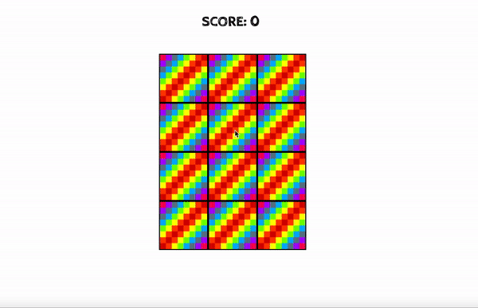

# Memory-game

## Table of contents

- [Overview](#overview)
- [Screenshot](#screenshot)
- [Links](#links)
- [My process](#my-process)
  - [Built with](#built-with)
  - [Challenges](#challenges)
  - [Continued development](#continued-development)

# Overview 
A mini project re-creating the classic memory game using vanilla JS, HTML and CSS. I had quite a lot of fun building this and it got me to use a lot of basic JS knowledge to implement the functionalities of the game.

# Screenshot

# Link

Live URL: [Click here](https://qymmore.github.io/memory-game/)

# My process

## Built with:
- Semantic HTML
- Custom CSS properties
- Vanilla JS

## Challenges 
- This game was relatively simple to create with JS. The main challenge was to come up with the logic behind controlling the states of each card and matching/not-matching them to a second card while also making sure that if they do not match then they flip back to their original state.

## Continued development
- Refactor the design to make it more responsive to smaller and larger screen sizes. 